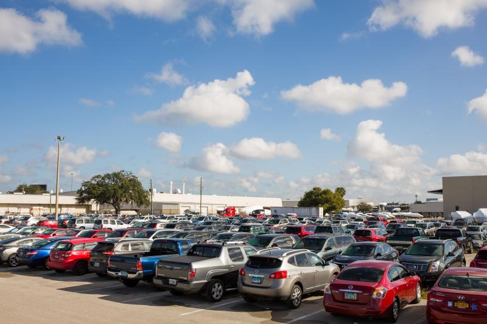
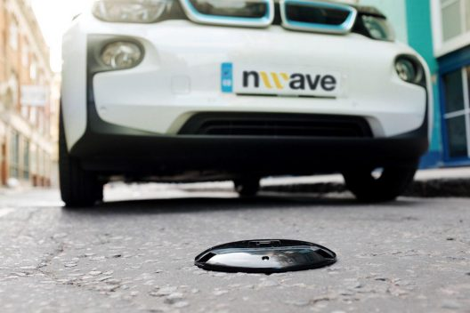
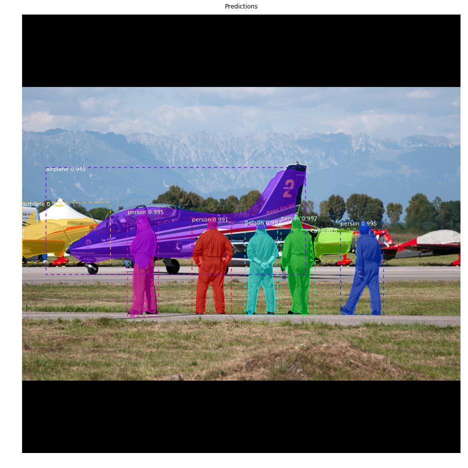

# PARKING SLOT DETECTION
Finding a vaccant spot in a parking  lot is a tough ask. It is even difficult to manage such facilites with a varying incoming traffic. Which slots are vaccant at this instant? What time do we need more slots. Are commuters finding it difficult to reach to a particular slot?

<br>
We corrently use either a network of ground mounted occupancy sensor or a large staff to determine some of the answers to these questions. Sensors are quite effective but need maintainence and cost about 40 -80$ per node in unit + installation. A staff only sollution is cumbersome and error prone
 
 <br>
One approch to the problem can be using the security camera footage to detect the slot occupancy using deep learning. While there are limitations (clear visibility trees shade , lighting) the approach can be extended to some lots atr a very minimal costs.
The code tries to address some these problems.

---

<a href="http://www.youtube.com/watch?feature=player_embedded&v=O4oNdFlYfgY" 
        target="_blank">
</a>

---

### APPROACH TO DETECT OCCUPANCY

The problem can be broken into two parts detecting the parking slot location and detection occupancy within the slots. We can manually mark the areas of the parking lots but this is a cumbersome process which has to be repeated each time we change the camra position. A better approach will be identify the slots from the security cam footage itself. Subesquently each of the identified slots can call a classifier to detect the presence/  absence of a car.

MaskRCNN /  YOLO provides us means to tackle the first problem while RESNET /VGG classifiers can help us detect occupancy.

---
<a href="http://www.youtube.com/watch?feature=player_embedded&v=lvY7Vyex2J0" 
        target="_blank">
</a>
---

## DOWNLOAD THE DATA

### DOWNLOAD THE IMAGES [CNRPARK Dataset]

We can use any video feed. For the purpose of demonstration feed from CNRPARK dataset (https://cnrpark.it) has been used.  It has a total of 164 parking spaces captured by 9 camera feeds in different climatic condition and lighting


```python
# Whole field of view
! wget http://cnrpark.it/dataset/CNR-EXT_FULL_IMAGE_1000x750.tar
! tar -xvf  CNR-EXT_FULL_IMAGE_1000x750.tar
! rm CNR-EXT_FULL_IMAGE_1000x750.tar


# Cropped image pathes of parking slots labelled as filled / empty 

! wget http://cnrpark.it/dataset/CNR-EXT-Patches-150x150.zip
! unzip CNR-EXT-Patches-150x150.zip
! rm CNR-EXT-Patches-150x150.zip

# VOC dataset for specializing yolo
! wget https://pjreddie.com/media/files/VOCtrainval_11-May-2012.tar
! wget https://pjreddie.com/media/files/VOCtrainval_06-Nov-2007.tar
! wget https://pjreddie.com/media/files/VOCtest_06-Nov-2007.tar
! tar xf VOCtrainval_11-May-2012.tar
! tar xf VOCtrainval_06-Nov-2007.tar
! tar xf VOCtest_06-Nov-2007.tar

! rm -rf VOCtrainval_11-May-2012.tar
! rm -rf VOCtrainval_06-Nov-2007.tar
! rm -rf VOCtest_06-Nov-2007.tar
```


### DOWNLOAD PRETRAINED MODEL WEIGHTS

I have used both maskrcnn and yolo. Maskrcnn unsuprisingly detects finer objects in the corners while yolo misses out on a few slots even after it has been specialized to detect only car classes. 


```
# YOLO
wget https://pjreddie.com/media/files/yolov3.weights
python ./convert.py ./yolov3.cfg yolov3.weights model_data/yolo.h5


# MASKRCNN
wget "https://github.com/matterport/Mask_RCNN/releases/download/v2.0/mask_rcnn_coco.h5"

```
<br>

<br>

<br>
### Specialize YOLO to cars
<br>

```python

# Load Voc Data
! python voc_annotation.py
# SPECIALIZE YOLO TO CARS
! python yolo_training.py

```
<br>
## DETECTION
<br>

```python

! python Parking_Slot_mask_rcnn.py
! python resnet_occupancy.py

```
